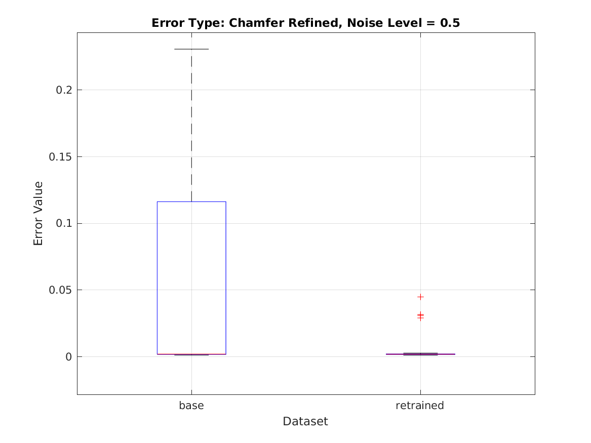

## Publications
1. **Curriculum Learning for Inverse Scattering Problems**  
   Authors: Nickolas Arustamyan, Carlos Borges
   *Pending Submission*, 2024.  

2. **Mixup Barcodes: Quantifying
Topological Interactions between Point Clouds**  
   Authors: Nickolas Arustamyan, Hubert Wagner, Matthew Wheeler, Peter Bubenik  
   *SoCG Workshop on Geometry and Machine Learning CG Week Workshop on Geometry and Machine Learning*, 2024,  
   [Link to Preprint](https://arxiv.org/abs/2402.15058)

3. **On the Number of Equilibria Balancing Newtonian Point Masses with a Central Force**  
   Authors: Nickolas Arustamyan, Erik Lundberg, Zvi Rosen, Sean Perry, Christopher Cox 
   *Journal of Mathematical Physics*, 2021.  
   [Link to Preprint](https://arxiv.org/abs/2106.11416)
   

## Active Research
### Curriculum Learning for Inverse Scattering
- **Overview**: I utilize Curriculum Learning models trained on multi-frequency data to generate initial guesses that are then fed into inverse problem solvers. These solvers utilize a Recursive Linearization architecture to converge to the true solution. 

- **Results**: Our results show comparable results to models not using Curriculum Learning, as expected. What is most interesting is that we are able to still get these results even when using less data, up to 50% less in some cases.

- 

- **Technologies**: MATLAB, Python, Tensorflow

### Mixup Barcodes
- **Overview**: I developed an automated pipeline for analyzing mixed-up datasets using topological data analysis. The workflow automated taking point cloud data, analyzing it using the computational topology software Ripser, and generating comprehensive visualizations and statistics.  We applied the pipeline to understanding how classification models learn by investigating how the embeddings of their predictions separated over time.

- **Results**: The results showcased that intuition matched expectations where less mixed up data was more easibly seperable and vice versa. 

- **Technologies**: Python, Pytorch, Ripser

## Projects
### Real-Time Speech Enhancement System Using Deep Learning
- **Description**: Implemented a Denoising Autoencoder combined with spectral subtraction to suppress background noises while preserving speech quality. The model was optimized for deployment on a Raspberry Pi using TFLite, achieving sub-100ms processing latency to enable real-time performance. System evaluation using industry-standard metrics (PESQ, STOI) demonstrated a 30% improvement in speech quality over baseline DSP methods.
- **Technologies**: Python, PyTorch, TFLite, ONNX, NumPy, C++

### Optimizing Public Transit Routes Using NYC MTA Open Data
- **Description**: Analyzed over 1 million records of public transit data to identify peak ridership patterns and congestion bottlenecks through time-series and geospatial analysis. Developed a predictive model using Random Forest to forecast ridership trends with an R² score of 0.85, enabling more accurate demand forecasting. Created an interactive dashboard using Streamlit for dynamic visualization and exploration of transit data and optimization scenarios.
- **Technologies**: Python, Pandas, scikit-learn, Matplotlib, Plotly, Streamlit
